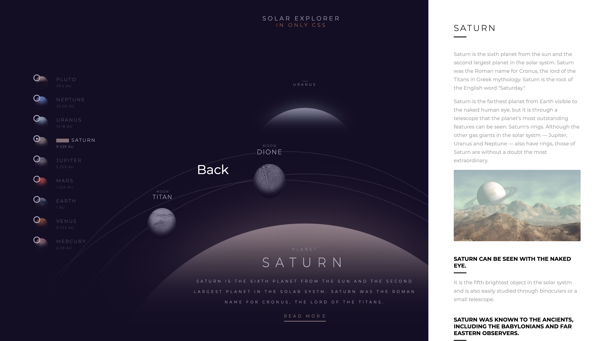

# Interstellar Explorer 🌌




**Interstellar Explorer** is an interactive web-based project that takes users on a journey through the universe, exploring different planets with stunning animations and detailed descriptions. This project is designed to be both educational and visually captivating.

## Features

- **Planet Descriptions**: Detailed information about each planet in the universe, including its characteristics, composition, and more.
- **Animations**: Smooth animations that bring each planet to life, enhancing the user experience.
- **Responsive Design**: The project is designed to be fully responsive, ensuring a seamless experience on all devices.

## Project Structure

```plaintext
├── style.css          # Main CSS file for styling
├── style.scss         # SASS file for easier and more modular styling
├── template.haml      # HAML template file for generating HTML
├── template.html      # HTML file generated from the HAML template
└── README.md          # Project documentation (this file)
```
## Getting Started
To get started with the project locally, follow these steps:

## Prerequisites
Ensure you have a modern web browser (Chrome, Firefox, Safari, etc.) for the best experience.
Installation
Clone the repository:

```git clone https://github.com/your-username/interstellar-explorer.git```
Navigate to the project directory:


```cd interstellar-explorer```
Compile the SASS file (optional):
If you need to make changes to the styles and prefer working with SASS:


```sass style.scss style.css```
Open the template.html file in your browser:
Simply double-click the template.html file or use a local server to view the project.

## Usage
Navigate through planets: The homepage allows you to explore different planets. Click on a planet to view its details and animations.
Interactive elements: Hover over planets to see animations and gain additional information.
Contributing
Contributions are welcome! Please fork the repository and submit a pull request with your changes. Make sure to follow the coding style and conventions used in the project.

## License
This project is licensed under the MIT License. See the LICENSE file for more details.

## Acknowledgments
Special thanks to all the space exploration enthusiasts and educators who inspired this project.
Resources and references used in the project are credited accordingly within the code.
Explore the universe like never before with Interstellar Explorer! 🚀


This `README.md` file provides a comprehensive overview of your project, including it
